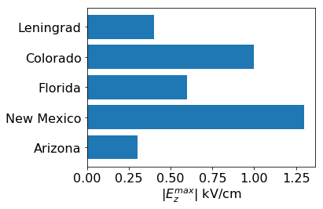
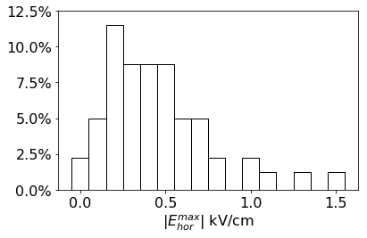

# Построение графиков

## Требование к графикам

Для построения графиков студенты могут использовать различные пакеты, так что общий стиль может отличаться, но все основные пакеты имеют весь необходимы для оформления лабораторных работ функционал:

* Позволяют экспортировать графики для печати.
* Позволяют использовать в названиях русский язык.
* Позволяют использовать для оформления Unicode или Latex, так что от студентов ожидается красивое оформление формул с использованием спецсимволов и  символов греческого или иного алфавита.
* Позволяют рисовать ошибки измерения, которые могут быть различны как для каждой оси, так и для каждого измерения. Так же можно указать ошибки в виде области.
* Позволяют строить все основные типы графиков: кривые, точки, гистограммы.
* Позволяют использовать различные цвета и прозрачность, а в случае если студент использует черно-белую печать различные типы линий (пунктир, штрих, штрихопунктир и т. д.) и штриховки (линейчатая, точечная и пр.)
* Позволяют устанавливать логарифмический масштаб для осей графика,  сетку на график, менять положение легенды.
* Позволяют управлять осями: строить на одном графике оси для разных величин, устанавливать промежуточные метки на осях, изменять подписи к меткам.
* Позволяют 
* Позволяют 
* FIXME

## Примеры

### Пример 1

* График адаптированн для черно-белой печати
* Используется двойной логарифмический масштаб
* Используется русский шрифт и формулы LaTex
* Есть сетка

### Пример 2

* График адаптированн для черно-белой печати
* Показаны ошибки высоты бина гистограммы

### Пример 3

* График адаптированн для цветной печати
* Показаны ошибки измерения по оси X, различные для каждого измерения

### Пример 4

* Используются категориальная ось Y.

### Пример 5

* Используются проценты для оси Y.

### Пример 6

*  Используются разные масштабы для оси Y: левая ось в кэВ/см, правая в кВ/см.

### Пример 7

* Ошибки результатов моделирования представлены в виде области.

